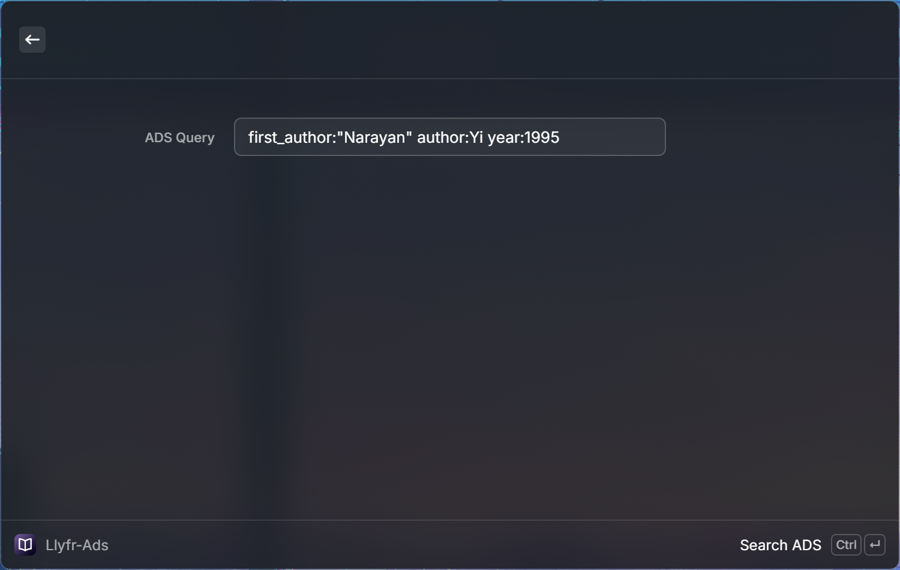

# Llyfr

BibTeX-compatible bibliography manager for scientific literature.

The extension includes two commands: `Llyfr` and `Llyfr-Ads`. `Llyfr` is designed to manage local files (fuzzy search, details view, opening pdf, etc.). `Llyfr-Ads` allows to send queries to the `Ads` service, fetching details for specific bibliographic entries, and allowing to add to the local offline library & downloading the PDF files.