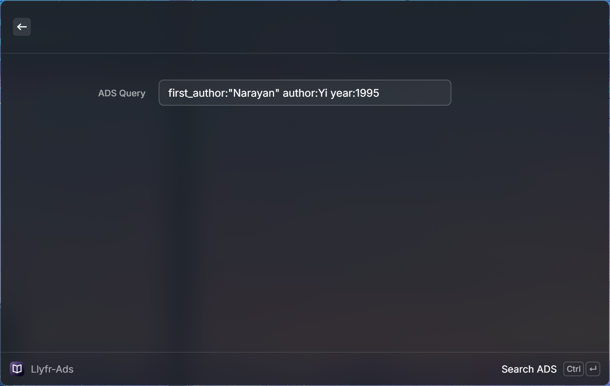

# Llyfr

BibTeX-compatible bibliography manager for scientific literature.



The extension includes two commands: `Llyfr` and `Llyfr-Ads`. `Llyfr` is designed to manage local files (fuzzy search, details view, opening pdf, etc.). `Llyfr-Ads` allows to send queries to the `Ads` service, fetching details for specific bibliographic entries, and allowing to add to the local offline library & downloading the PDF files.

## Running the extension

Llyfr runs on both [Raycast](https://raycast.com) (macOS/Windows) and [Vicinae](https://vicinae.com) (Linux). The source is shared between both — the UI is written against the `@raycast/api`, which Vicinae resolves at runtime, so no per-launcher code is required.

Install dependencies once:

```sh
npm install
```

### Raycast

```sh
npm run dev      # develop with hot reload (ray develop)
npm run build    # build the extension (ray build)
npm run lint     # lint (ray lint)
```

### Vicinae

```sh
npm run dev:vicinae      # develop with hot reload (vici develop)
npm run build:vicinae    # build & install the extension (vici build)
```

`vici build` compiles both commands and installs the extension into `~/.local/share/vicinae/extensions/llyfr`; it shows up in the launcher without a restart.